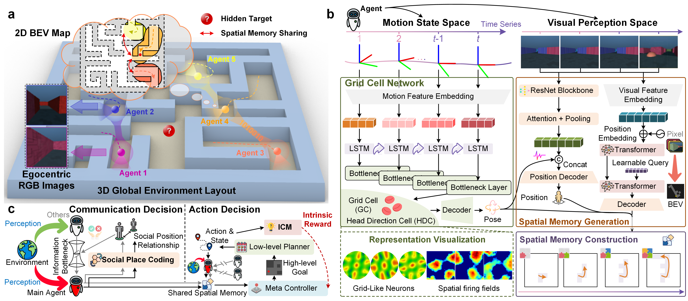

# Shared Spatial Memory Through Predictive Coding

This repository provides the **official open-source implementation** of  
**“Shared Spatial Memory Through Predictive Coding” (Fang et al., 2025)**.  
The framework unifies **grid-cell-like spatial coding**, **predictive BEV reconstruction**,  
and **communication-efficient shared spatial memory** under a single predictive-coding objective.  

> **Paper:** [https://arxiv.org/abs/2511.04235](https://arxiv.org/abs/2511.04235)  
> **Project Page:** [http://fangzr.github.io/SSM-PC/index.html](http://fangzr.github.io/SSM-PC/index.html)

---

## Paper Overview

Sharing and reconstructing a coherent map is notoriously challenging in partially observed, bandwidth-limited environments.  
The associated paper reframes cooperation as **minimizing mutual predictive uncertainty**:  
agents communicate only the bits that most reduce their partners' prediction error.

**Core ingredients:**
- A **grid-cell-like metric scaffold** emerging from self-supervised motion forecasting, supporting accurate self-localization.  
- **Social place-cell (SPC)** populations that encode teammates’ trajectories, enabling agents to infer partner locations.  
- A **hierarchical RL policy (HRL-ICM)** that decides *when* to communicate, guided by an information-bottleneck objective.

On the Memory-Maze benchmark, this predictive-coding strategy maintains robustness even when link budget drops from  
128 → 4 bits per step (success rate 73.5% → 64.4%), while a full-broadcast baseline collapses from 67.6% → 28.6%.



*Figure 1. Predictive coding framework for shared spatial memory.  
(a) Cooperative navigation; (b) self-localization scaffold built from emergent grid codes;  
(c) communication-aware decision loop guided by uncertainty reduction.*

<p align="center">
  
  
  
  
</p>

*Figure 2. Emergence of grid-cell-like predictions across training epochs.*

---

## 📂 Repository Layout

```

SSM-PC/
├── grid_cell/             # Grid-cell spatial metric learning
├── bev_generation/        # Predictive BEV reconstruction
├── LICENSE
└── README.md

````

Additional modules (SPC, spatial memory reconstruction, HRL-ICM, and IB-based communication)  
are listed below for clarity and future open-sourcing.

---

## 1. Spatial Metric Learning (Grid-Cell Module)

Located in `grid_cell/`, this module implements training, inference, and visualization of grid-cell-like representations.

### Key Scripts
| Purpose | Command |
|----------|----------|
| Train main model | `python train_grid_cells.py --gpus 0,1` |
| Run gridness analysis | `python run_gridness_analysis.py` |
| Visualize grid cells | `python grid_cell_visualization.py --model_path <ckpt>` |
| Generate training videos | `python generate_video5.py --checkpoint_dirs <dir ...> --output_dir demo-output/video5` |

#### Training
```bash
python train_grid_cells.py --gpus 0,1
````

Supports DDP multi-GPU training; outputs are stored under `grid_cell/log_train_grid_cells/`.

#### Visualization

Includes:

* Rate maps and grid alignment statistics
* Trajectory comparison plots
* Multi-epoch visualization videos

#### Requirements

```bash
pip install -r grid_cell/requirements.txt
```

---

## 2. Predictive BEV Reconstruction

Located in `bev_generation/`, this module learns to reconstruct a **bird’s-eye-view (BEV)** map from egocentric RGB frames
via a Transformer-based visual predictive model.

### Key Scripts

| Purpose                                  | Command                                                                    |
| ---------------------------------------- | -------------------------------------------------------------------------- |
| Train BEV predictor                      | `python train.py`                                                          |
| Multi-GPU training                       | `python train_multi_gpu.py --config <cfg_json>`                            |
| Train target detector                    | `python train_target_detector.py`                                          |
| Inference & video output                 | `python visualization_output.py --bev_model <ckpt> --target_model <ckpt>`  |
| Spatial Memory Reconstruction (was SLAM) | `python run_visualization.py --dataset_path <seq> --model_path <bev_ckpt>` |

This module supports environment variables (`BEV_MODEL_PATH`, `BEV_DATASET_PATH`, etc.) for flexible configuration.

#### Requirements

```bash
pip install -r bev_generation/requirements.txt
```

---

## 3. Shared Spatial Memory & HRL-ICM (Planned)

### Planned Features

* **Spatial Memory Reconstruction** module integrating grid-cell metrics and BEV predictions
* **Social Place Cell (SPC) module** for partner-location encoding
* **Hierarchical RL policy (HRL-ICM)** for communication-efficient exploration
* **Information Bottleneck (IB) compression pipeline** for predictive communication

### TODO Status

| Module                               | Status      |
| ------------------------------------ | ----------- |
| Grid-cell spatial metric scaffold    | ✅ Completed |
| Predictive BEV reconstruction        | ✅ Completed |
| Shared Spatial Memory reconstruction | ⬜ Pending   |
| HRL-ICM hierarchical exploration     | ⬜ Pending   |

---

## Dataset Preparation

### Grid-Cell Module

* Default: `grid_cell/data/self-navigation-maze-frame-only/`
* Override via `GRID_DATA_ROOT`

### BEV Module

* Default: `bev_generation/data/`
* Override via `BEV_DATA_ROOT`

Each dataset directory should contain JSON metadata (`frame_info.json`, `env_config.json`)
and image assets compatible with the dataset loaders.

---

## Reproducing Paper Results

1. Prepare datasets as above.
2. Train the grid-cell module or use provided checkpoints.
3. Run gridness analyses and reproduce training videos (Video 5, trajectory comparison).
4. Train or reuse BEV predictor weights, then visualize spatial memory reconstruction results.

---

## Citation

If you use this repository, please cite:

```bibtex
@misc{fang2025sharedspatialmemorypredictive,
  title={Shared Spatial Memory Through Predictive Coding},
  author={Zhengru Fang and Yu Guo and Jingjing Wang and Yuang Zhang and Haonan An and Yinhai Wang and Yuguang Fang},
  year={2025},
  eprint={2511.04235},
  archivePrefix={arXiv},
  primaryClass={cs.AI},
  url={https://arxiv.org/abs/2511.04235},
}
```
